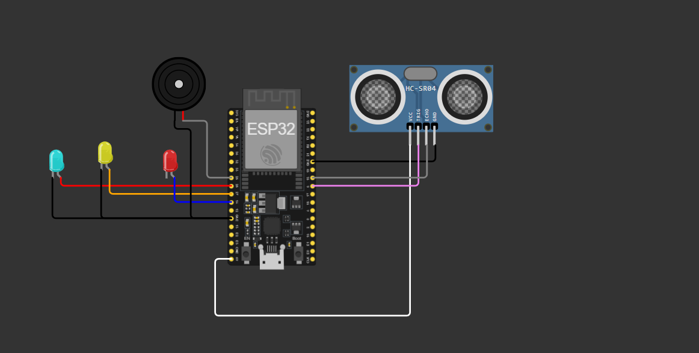
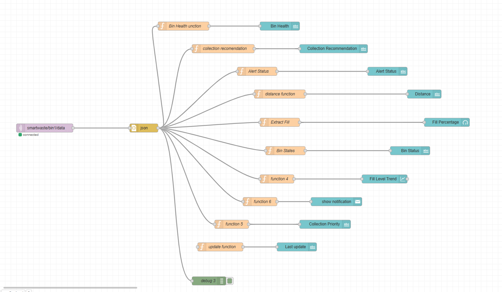
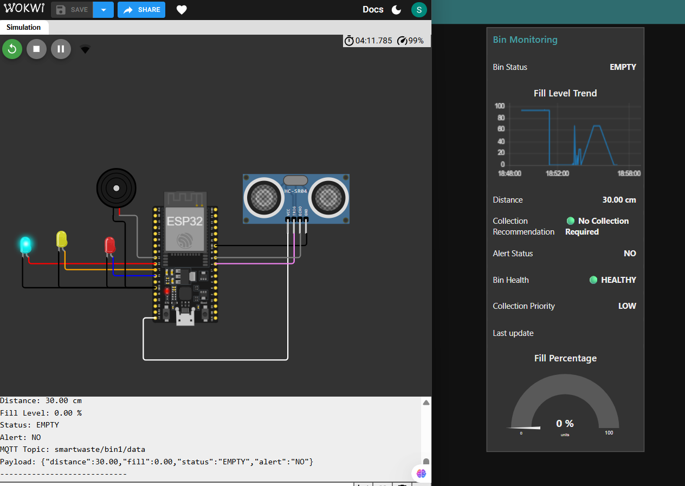
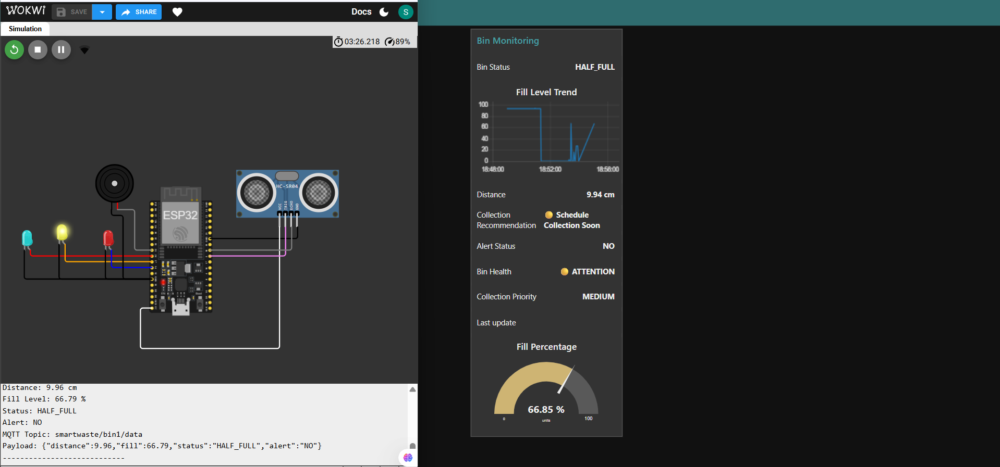
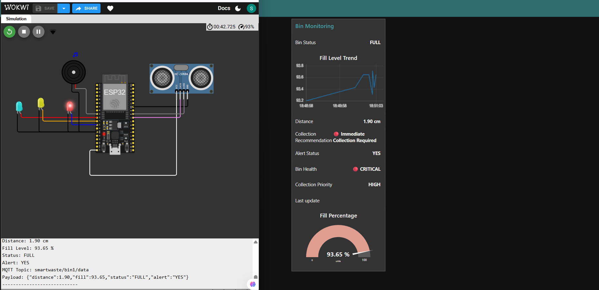

# 🗑️ Smart Waste Management & Bin Level Detection System


## 🌍 Project Overview

The **Smart Waste Management & Bin Level Detection System** is an IoT-based solution designed to monitor garbage bin fill levels in real time.

The system uses an **HC-SR04 Ultrasonic Sensor** connected to an **ESP32** to measure waste levels inside a bin. Data is transmitted using the **MQTT protocol** to a **Node-RED Dashboard**, where users can monitor fill percentage, bin status, collection priority, and alerts.

This project demonstrates real-world IoT concepts used in **Smart Cities**, **Municipal Waste Management**, **Smart Campuses**, **Airports**, and **Railway Stations**.

---

## 🚀 Problem Statement

Traditional waste collection systems face several challenges:

* Overflowing garbage bins
* Unnecessary collection trips
* Fuel wastage
* Increased operational costs
* Poor hygiene conditions

This project aims to solve these issues through real-time monitoring and intelligent waste collection recommendations.

---

## 🎯 Objectives

* Monitor garbage bin fill levels in real time.
* Detect full bins before overflow occurs.
* Generate alerts for collection staff.
* Visualize waste data through dashboards.
* Demonstrate practical IoT implementation.
* Support smart city infrastructure.

---

## 🏗️ System Architecture

```text
HC-SR04 Ultrasonic Sensor
            │
            ▼
         ESP32
            │
            ▼
      MQTT Protocol
            │
            ▼
      EMQX Broker
            │
            ▼
        Node-RED
            │
            ▼
      Live Dashboard
            │
            ▼
   Alerts & Recommendations
```

---

## 🛠️ Tech Stack

### Hardware

* ESP32
* HC-SR04 Ultrasonic Sensor
* LEDs
* Buzzer

### Software

* Arduino IDE
* Wokwi Simulator
* MQTT
* EMQX Broker
* Node-RED
* GitHub

---

## ⚙️ Features

### Real-Time Bin Monitoring

* Continuous distance measurement
* Live fill percentage calculation

### Smart Alerts

* Full bin detection
* Dashboard notifications
* Collection recommendations

### Dashboard Analytics

* Fill percentage gauge
* Historical trend chart
* Bin health monitoring
* Collection priority assessment

### MQTT Communication

* Real-time data publishing
* Scalable architecture
* Multi-bin expansion ready

---

## 📊 Dashboard Features

### Fill Percentage Gauge

Displays:

* Empty (0–40%)
* Half Full (40–80%)
* Full (80–100%)

### Bin Status

* EMPTY
* HALF_FULL
* FULL

### Bin Health

* 🟢 HEALTHY
* 🟡 ATTENTION
* 🔴 CRITICAL

### Collection Priority

* LOW
* MEDIUM
* HIGH

### Alerts

Automatic notification when fill level exceeds threshold.

---

## 📷 Project Screenshots

### ESP32 Simulation



### Node-RED Flow



### Empty Bin Dashboard



### Half Full Dashboard



### Full Bin Dashboard



### Alert Notification


---

## 📡 MQTT Configuration

### Broker

```text
broker.emqx.io
```

### Port

```text
1883
```

### Topic

```text
smartwaste/bin1/data
```

### Example Payload

```json
{
  "distance": 1.90,
  "fill": 93.65,
  "status": "FULL",
  "alert": "YES"
}
```

---

## 🔌 Wiring Connections

### HC-SR04

| HC-SR04 | ESP32   |
| ------- | ------- |
| VCC     | 5V      |
| GND     | GND     |
| TRIG    | GPIO 5  |
| ECHO    | GPIO 18 |

### LEDs

| LED    | GPIO    |
| ------ | ------- |
| Green  | GPIO 26 |
| Yellow | GPIO 27 |
| Red    | GPIO 14 |

### Buzzer

| Buzzer   | GPIO    |
| -------- | ------- |
| Positive | GPIO 25 |

---

## 🧪 Testing Results

| Distance | Fill Percentage | Status    |
| -------- | --------------- | --------- |
| 30 cm    | 0%              | EMPTY     |
| 15 cm    | 50%             | HALF_FULL |
| 2 cm     | 93%             | FULL      |

The system successfully generated alerts and dashboard updates for all tested scenarios.

---

## 🌟 Real-World Applications

* Smart Cities
* Municipal Corporations
* Airports
* Railway Stations
* Universities
* Smart Campuses
* Shopping Malls
* Corporate Parks

---

## 📈 Future Enhancements

* GPS-enabled smart bins
* Multiple bin monitoring
* Mobile app integration
* AI-based waste prediction
* Route optimization for collection vehicles
* Cloud database integration
* Solar-powered deployment

---

## 📂 Project Structure

```text
Smart-Waste-Management-Bin-Level-Detection-System/

├── arduino_code/
├── dashboard/
├── circuit_diagram/
├── docs/
├── reports/
├── images/
├── README.md
└── requirements.txt
```

---

## 🏆 Key Learning Outcomes

* IoT System Design
* ESP32 Programming
* MQTT Communication
* Node-RED Dashboard Development
* Real-Time Monitoring Systems
* Smart City Applications
* Embedded Systems Development

---

## 👨‍💻 Author

**Sujal Kumar Shaw**

B.Tech Student | IoT & Embedded Systems Enthusiast


---

### ⭐ If you found this project useful, consider giving it a star!
